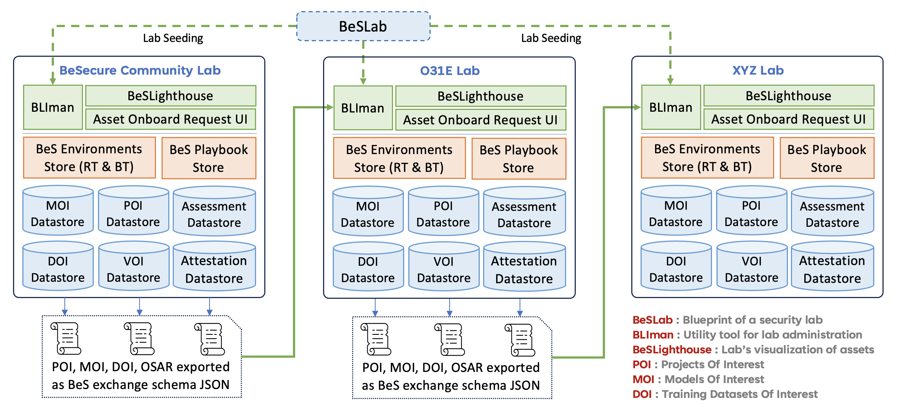

# BeS-Schema - BeSLab Interchange Schema Definitions

BeSLab is an open source security lab dedicated to fortifying open source projects against potential vulnerabilities. Designed to operate efficiently even in low-resource settings, BeSLab provides a comprehensive solution that grants complete control and transparency to application security and security operations teams.

### Interchange Schema Definitions for BeS Eco System entities.
- Open Source Software Projects of Interest (OSSPoI)
- Open Source Software Vulnerabilities of Interest (OSSVoI)
- Open Source Models of Interest (OSMoI) 
- Open Source Assessment Report (OSAR)
- Exploit & Attack Simuation (EAS)
- BeS Environment Info & Status
- BeS Playbook Info & Status
- BeS Lab Info & Status
- BeS Lab Attestation History & Record

We hope to define a simple format that all BeS Labs can export,
to make it easier for users, security researchers, and any other efforts to
consume all available databases. Use of this format would also make it easier
for the databases themselves to share or cross-check information. Ultimately,
this format aims to enable automated, accurate, and distributed management
of open source asset security information.

### BeS Lab Interactions

An easy-to-use data format that maps precisely to various data exchange needs between cybersecurity analysts and security labs. These schema definitions address many of the shortcomings of dealing with vulnerabilities in open source software and ML models in Be-Secure ecosystem.

These unified format means that vulnerability databases, open source users, and security researchers can easily share tooling and consume vulnerabilities across all of open source. This means a more complete view of vulnerabilities in open source for everyone, as well as faster detection and remediation times resulting from easier automation.

## Report Issue
BeS-Schema uses GitHub's integrated issue tracking system to record bugs and feature requests. If you want to raise an issue, please follow the recommendations below:

* Before you log a bug, please search the [issue tracker](https://github.com/Be-Secure/bes-schema/issues) to see if someone has already reported the problem.
* If the issue doesn't already exist, [create a new issue](https://github.com/Be-Secure/bes-schema/issues/new/choose).
* Please provide as much information as possible with the issue report.
We like to know the BeS-Schema version you're using.
* If possible, try to attach the screenshot of the issue.

## License
BeS-Schema is an Open Source project released under the [Apache 2.0 license](https://www.apache.org/licenses/LICENSE-2.0.html).